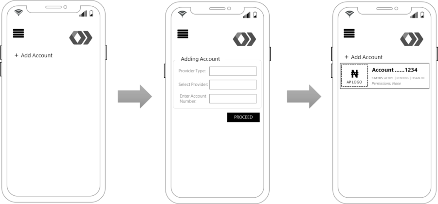

# Mobile App Interface Guidelines

### Adding an AP account on the TPP Interface  

.png>)

### Account-holder authentication _**options**_ on AP channel 

.png>)

### Adding an AP account on the TPP Interface 

