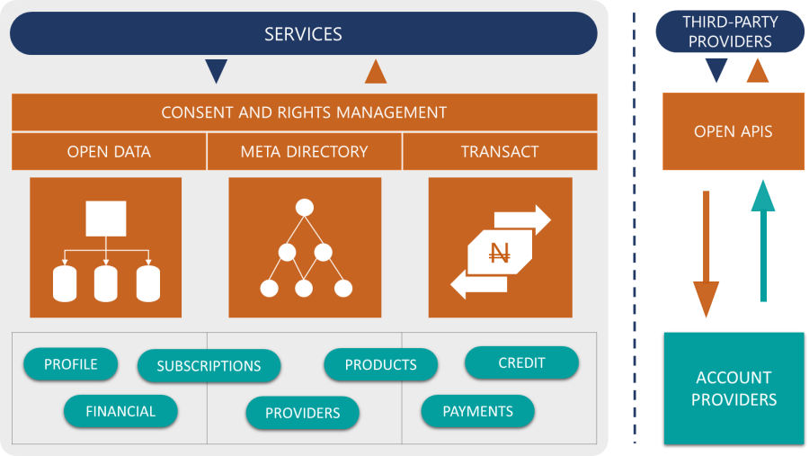

# Open Banking Standard

* Design Principles
* Rationale
* Governance
* Participants and Roles
* Systems Architecture
* Value Proposition
* Summary
* FAQs

### Design Principles 

Open APIs are public (i.e. accessible over the internet) interfaces to proprietary systems made available in a test area at the minimum, to foster the development of innovative use-cases employing the APIs. When such APIs apply to the banking and financial systems, such networks have come to be known as an Open Banking network or system.

The goal of Open Banking is to democratize banking and financial services to widen financial inclusion and foster the development of financial products by easing access and participation of secondary providers; where such _providers_ are usually non-traditional financial institutions. While most proponents for an Open Banking system share this goal, the interpretation of what the Open Banking system constitutes and by inference how it is designed and implemented would differ largely due to prevailing economic, social, regulatory and infrastructural levers within the specific economies.

Therefore, Open Banking Nigeria (OBN) standard tailors to the particulars of Nigeria's payments environment. The APIs are designed to simplify and structure access to financial services on both supply and demand side, while ensuring the highest standards of consumer data protection and systems security are employed.

On this basis, the following are guiding principles of the network design:

1. **Non-regulatory:** The standard is not deemed _regulation_ to participants. The intent is to promote democratic adoption and permeation of the APIs, removing legacy institutional barriers to create an ecosystem propelled by evolving business models, financial products, risk appetites, and investment capacity.
2. **Simple:** Given the terrain, the standard specifies just the essential requirements to provide functional structure, maintain security and be operable with known and easily accessible technology platforms. This is expected to promote adoption across all institutional scales, ensuring that every relevant institution has a fair opportunity to participate. The standard will continue to be refined for emerging requirements and technologies.
3. **Venture-driven:** Varying appetites for risk and opportunity are accommodated within the framework by prescribing a minimal set of _required_ services for core service providers, beyond which each organization can configure offerings and enter into partnerships purely on the merit of the opportunities.
4. **Consumer-focused:** The standard should guide participants in building systems and operations with the consumers' needs as the core consideration. The network should provide transparency, security, privacy, and control to users. The end-user experience should be guided by simplistic designs, nevertheless, speed and flow are paramount.

### Rationale 

The design caters to structural, procedural and data exchange requirements necessary to operate a secure and open payments system. To achieve this in the best-fit approach, the standard centers on the interface with the core financial service providers as the foundational infrastructure for the open system, allowing evolving market needs to define secondary or higher-level architectures if necessary. While these higher levels of infrastructure are not elaborated, the framework assures consistency in quality of end-user experience by prescribing guidelines for core consumer processes that are key to the Open Banking experience.

The standard also does not define or delve into commercial or contractual obligations among participant organizations. Financial institutions are encouraged to adopt open APIs, partner with organizations that promote their ambitions and adopt business operations that align with their risk models.

### Governance 

Open Technology Foundation (OTF) is a not-for-profit organization comprising payments professionals representing various individual and corporate efforts to promote an Open Banking system. OTF defines, maintains and promotes Open Banking standard consisting of API specifications and accompanying security and process guidelines.

OTF currently comprises corporate membership such as Commercial Banks, Fintechs and consulting firms as well as individual members typically those operating professionally within the payments and financial services sector. The foundation is open to anyone with a stake, interest or contribution to the financial and payments services sector of the economy. The trustees of the foundation conduct the day to day operations while non-trustee members lend their expertise and resources to the objectives of the foundation. Members of the foundation work alongside the governing committee of the foundation to define and refine the Open Banking standards. All member institutions have equal rights.

Nigeria Open Banking standard is published on the Open Banking Nigeria (OBN) portal: [_https://openbanking.ng_](https://openbanking.ng). The portal serves as the information hub for all updates and developments with the standard. It does not currently actively participate in the interconnection of participants in the Open Banking system. However, the portal serves as a certification center for institutions to self-test their Open Banking APIs and publish their offerings after successfully going through the test stages. The primary objective is the definition and promotion of a standard to address a fundamental payment ecosystem need.

### Participants and Roles 

Given the Open Banking proposition, any organization that provides financial and payment services within the country is a potential participant. This includes but is not limited to:

1. Regulators such as the Central Bank of Nigeria (CBN)
2. Licensed Interbank Switching companies
3. Payment Card Scheme companies
4. Commercial, Merchant, Mortgage, Microfinance, Digital-only and Payment Service Banks operating at any scale;
5. Mobile Money Operators
6. Financial Technology Providers
7. Bill and Utility Payment Aggregators
8. Tertiary finance institutions such as Mutual Funds, Investment Houses, Insurance brokers.

Logically, the framework categorizes all participants into the following roles, where a participant could play one or more roles depending on their services and offerings:

1. **Account Providers (AP)** – being the core of the Open Banking network, these organizations provide access to consumer funds which could be traditional consumer accounts held by Commercial Banks and Microfinance Institutions or non-traditional, such as Mobile Money Operators, Credit Unions, Prepaid Card Systems, etc. In the broad sense, institutions operating at this level are able to maintain the financial balances of individual customers and provide data and payment services to other institutions within the Open Banking network.
2. **Third-Party Providers (TPP)** – are technology and financial services companies that occupy the "service-side" of the Open Banking system and typically integrate with open APIs exposed by APs while providing services to end-users directly or through other similar organizations in the value chain.
3. **Platform Providers (PP)** – while this role is not currently set out within this framework, there is a very high likelihood of the emergence of entities that perform an aggregation function, therefore, making it worthy of mention in this material. These entities would aggregate connections to multiple APs and act as a single point of integration for other Financial and Payment Service Providers (FPSPs) that wish to participate in the Open Banking framework. For the purpose of this document, the term Third-Party Providers includes such providers except otherwise exclusively stated.

### Systems Architecture 

The design places the AP role at the foundation of the Open Banking network. A logical architecture is shown in figure 1.0 below. Open APIs provide the rails for TPPs to access AP platforms and services. Open APIs consist of CRUD (Create, Read, Update, Delete) functions that are grouped into the following four categories based on similarities in the API functions: Registration, Meta Directory, Data-Inquiry (Open Data), and Payments.

1. **Registration APIs** provide the framework for Identity management, verification, and permission controls to access other APIs.
2. **Meta Directory APIs** provide a collection of cacheable, less volatile information essential for payloads sent/received within the network.
3. **Data-Inquiry (or Open Data) APIs** contain a collection of financial data objects for which TPPs can be given access to read general financial institution information.
4. **Payment APIs** contain APIs that return customer information and permit payment operations such as basic debit and credit operations as well as other specialized payment flows. The baseline criteria for APIs in this collection is the fact that these APIs involve the movement of accountholder funds or access to individual consumer data.

TPPs connect directly to these APIs essentially bridging the supply-side of financial service and then provide platforms to connect the demand side: users and consumers. The architecture at the TPP level and further onward is not covered by the Open Banking specifications. The Open Banking network is expected to complement other payment networks. Participants' connections to NIBSS Instant Pay, switching networks, service, and utility provider payment aggregators serve to enrich the Open Banking offering, creating an ecosystem of boundless connectivity and robust possibilities.

### Value Proposition 

As is typical of an open system, innovation is expected to create new propositions that derive benefits for all stakeholders. We expect to see propositions along these lines:

1. **Financial Inclusion:** Open APIs will allow FPSPs to build inclusive products, typically over digital channels, for the financially excluded and most vulnerable members of the society. Thinning out the financial exclusion indices within any economy is expected to have multi-faceted effects to improve the socioeconomic well-being of its citizens.
2. **Data:** Seamless access to financial data across the entire banking ecosystem means primary data such as average income and consumption expenditure over a period can be applied to estimate the creditworthiness of non-salary earners for non-collateral loans. Secondary data such as user spend analysis opens a new horizon of data services to deduce consumer choices and provide more streamlined offerings. Artificial Intelligence and Big data management opportunities are likely to emerge from these new horizons.
3. **Access:** Consumers are expected to experience broader means and channels of access to finances which would vary in degree of ease and sophistication. We expect to see emerging products and technologies in communication, identity verification, and authentication, access and consent management take center stage in expanding the net of inclusion. While closed financial payments systems provide little incentives for participants to undertake these investments independently, Open Banking players can bring this to fruition by leveraging services (in whole or part) provided by other participants within an open ecosystem.
4. **Provider Selection:** Customers will have access to a network of providers to select the best fit for their needs with little to no barriers to mobility. This increased competition should drive prices of primary financial services downwards and ultimately, secondary and more sophisticated financial services such as data-based offerings, asset refinancing, cross-selling, etc. will serve as differentiating factors.
5. **Transacting:** The above scenarios are further entrenched by the innate mobility of funds within an open system where customers can allocate or move funds easily to their preferred providers. Payments or the activity of making a payment is expected to devolve into less of an activity and more contextualized to the particulars of a transaction. For example, instead of paying with a mobile phone solution, a car could just as well pay for the fuel it receives from the vendor.
6. **Security:** Open Banking simplifies integrating to legacy financial institutions by providing a single framework with standard security features and processes, apt for financial-grade services. This ensures a uniform implementation by APs, reducing the risks to both APs and TPPs if each party alternatively had to develop their own standards.

### Summary 

The OBN standard and specifications enable APs to create secure and structured interfaces for accessing customer financial data and initiating payments against customer accounts. APs can apply this document as a guide for designing and setting up Open Banking infrastructure, as well as best practice procedures to operate the services.

TPPs can simply adopt the specifications provided here to gain access to the network and connect to each AP, subject to overarching business interests among participants. TPPs are expected to also adopt the guidelines in operating their solutions and services within the network. With a paramount focus on consumer privacy and data protection, strict requirements are stipulated on how such providers should utilize and protect customer financial data, maintain consumer control and provide transparent and competitive financial services.

Subsequent sections of this standard detail the specifications covering data exchange mechanics, a robust security framework, operational guidelines and customer experience requirements that collectively make up this standard.

### FAQs 

* Is Open Banking a payment platform?

_In the current design for Nigeria, OBN portal or Open Banking_ _is NOT a payment platform. OBN is simply a standard_ _which embodies the framework_ _required of institutions intending to participate alongside other certified financial institutions in the open banking network. FPSPs will have to connect to the institution endpoints directly and not through_ _OBN portal._

* Will there be an Open Banking Enterprise Service Bus (ESB)?

_We expect that aggregators will provide such ESBs to manage connections to financial institutions and from their clients. However, OBN will not require or provide this infrastructure as part of the current standard._

* Who owns Open Banking Nigeria Standard?

_Open Banking Nigeria standard is open to the entire Nigerian financial industry and is not under any ownership. Open Technology Foundation is_ _presently the custodian of the standard._

* How do I know if my bank participates in Open Banking?

_OBN maintains a registry of certified participant APs which are listed on the OBN portal at_ [_https://aps.openbankingng.com_](https://aps.openbankingng.com)_. If your bank is listed on OBN portal, they would also provide a list of platforms and solutions that they have allowed to connect._

* Is Open Banking regulated by the government or any other payments system regulators?

_Currently, no._

* Who will continue to maintain and govern Open Banking standards?

_Open Technology Foundation trustees are currently responsible for maintaining the Open Banking standards for the foreseeable future. This function may be passed on in future if the move is determined to foster the payments and financial services sector._
